# 🏗️ Архитектура системы

Подробное описание архитектуры системы рекомендаций на основе GNN с диаграммами.

---

## 📊 Общий Pipeline

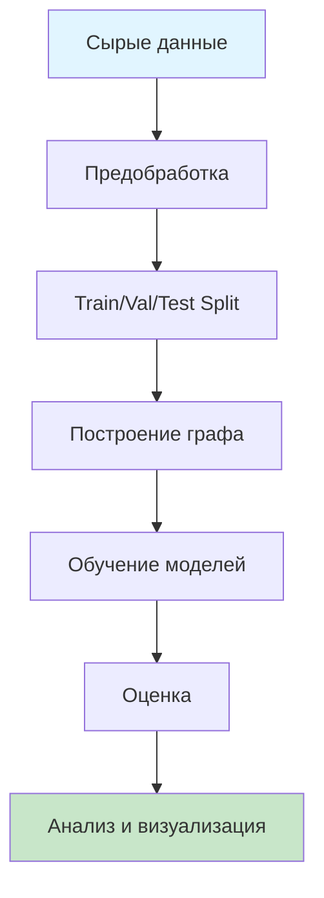

---

## 🔄 Процесс обучения

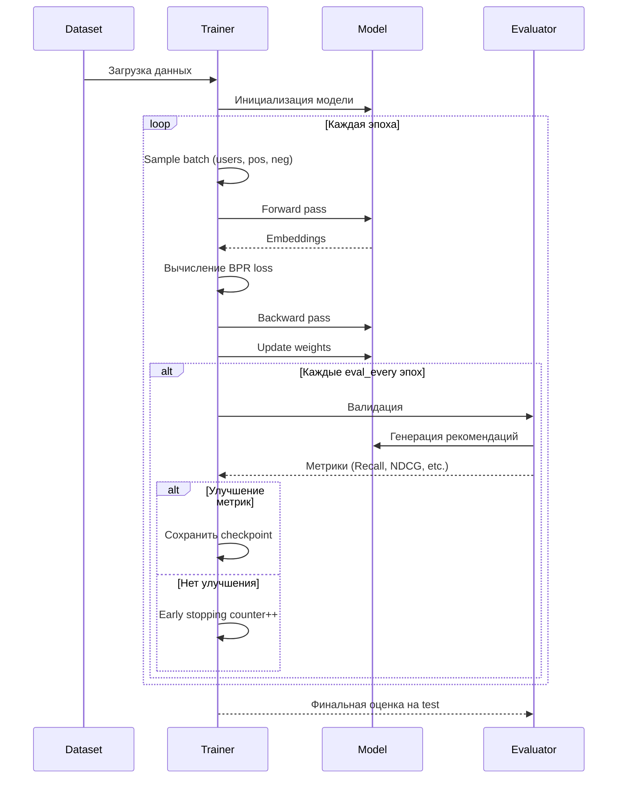

---

## 🧠 Архитектура GroupShuffleGNN

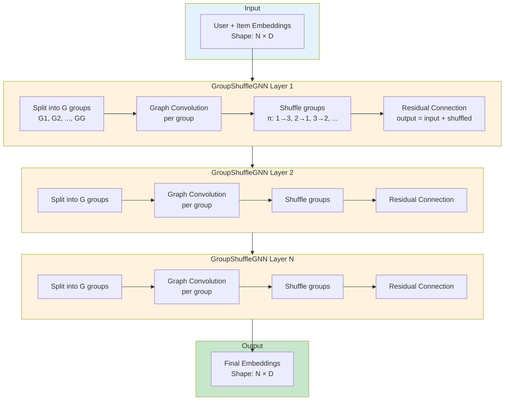

---

## 🔀 Group Shuffle Mechanism

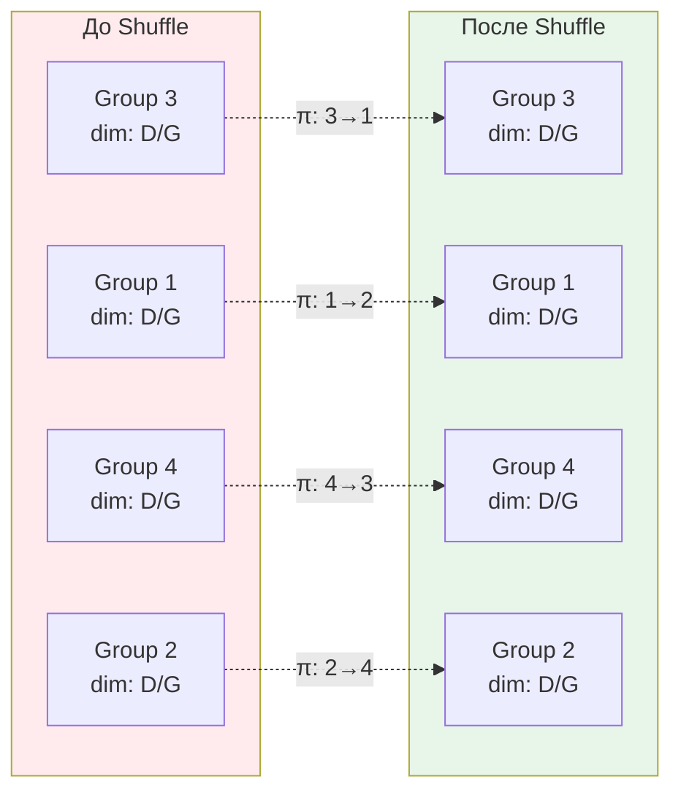

**Эффект**: Разные группы взаимодействуют между слоями, предотвращая over-smoothing.

---

## 🎯 Граф User-Item

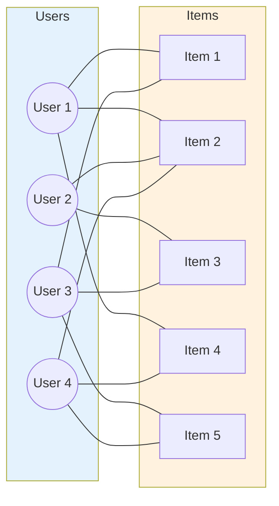

**Adjacency Matrix**:
```
     I1  I2  I3  I4  I5
U1 [ 1   1   0   1   0 ]
U2 [ 0   1   1   0   0 ]
U3 [ 1   0   1   0   1 ]
U4 [ 0   1   0   1   1 ]
```

---

## 📦 Структура классов

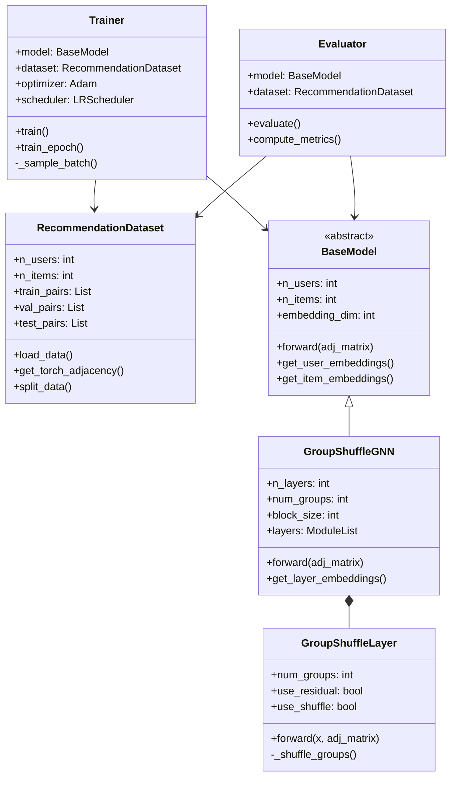

---

## 🔄 Сравнение моделей

```mermaid
graph TB
    subgraph BPR_MF[BPR-MF]
        BM1[User Embedding]
        BM2[Item Embedding]
        BM3[Dot Product]
        
        BM1 --> BM3
        BM2 --> BM3
    end
    
    subgraph LightGCN[LightGCN]
        LG1[Initial Embeddings]
        LG2[Layer 1: A @ E]
        LG3[Layer 2: A @ E]
        LG4[Layer 3: A @ E]
        LG5[Mean Aggregation]
        
        LG1 --> LG2 --> LG3 --> LG4 --> LG5
    end
    
    subgraph GCNII[GCNII]
        GC1[Initial Embeddings]
        GC2[Layer 1: αE₀ + 1-α·AE]
        GC3[Layer 2: αE₀ + 1-α·AE]
        GC4[Layer 3: αE₀ + 1-α·AE]
        GC5[Final Embeddings]
        
        GC1 --> GC2 --> GC3 --> GC4 --> GC5
    end
    
    subgraph GroupShuffle[GroupShuffleGNN]
        GS1[Initial Embeddings]
        GS2[Layer 1: Group + Shuffle]
        GS3[Layer 2: Group + Shuffle]
        GS4[Layer 3: Group + Shuffle]
        GS5[Final Embeddings]
        
        GS1 --> GS2 --> GS3 --> GS4 --> GS5
    end
    
    style BPR_MF fill:#ffebee
    style LightGCN fill:#e3f2fd
    style GCNII fill:#f3e5f5
    style GroupShuffle fill:#e8f5e9
```

---

## 📊 Эксперименты

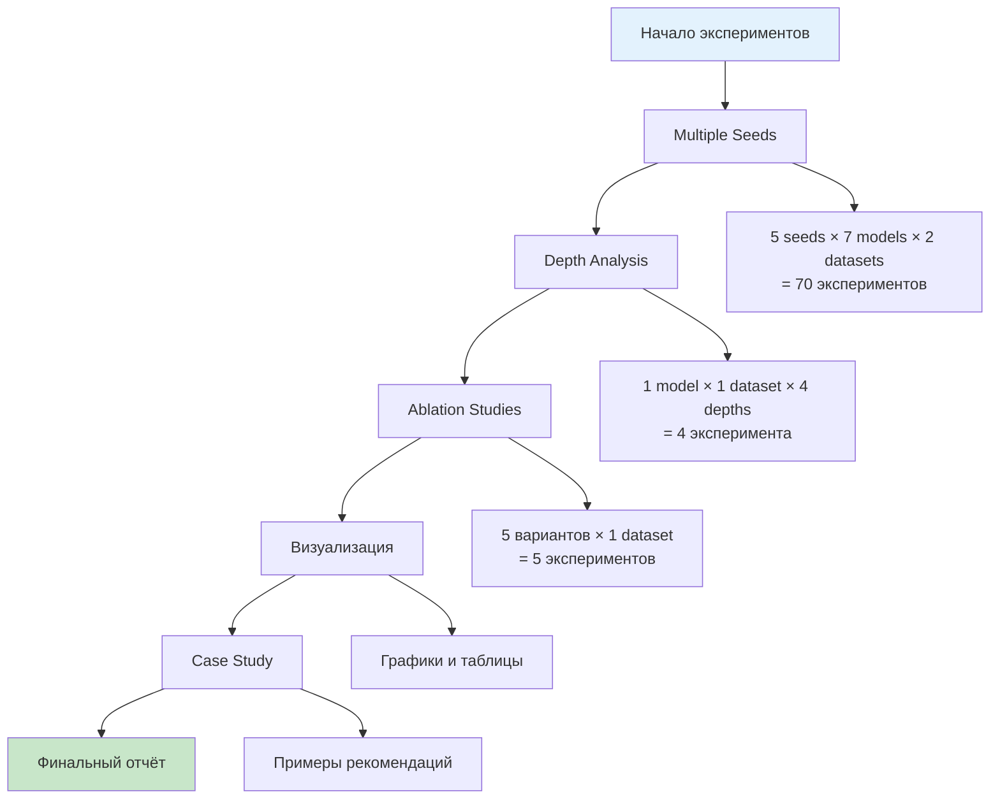

---

## 🎯 Метрики качества

```mermaid
graph LR
    subgraph Ranking[Ranking Metrics]
        R1[Recall@K<br/>Сколько релевантных<br/>нашли из всех]
        R2[NDCG@K<br/>Normalized Discounted<br/>Cumulative Gain]
        R3[Precision@K<br/>Доля релевантных<br/>в топ-K]
    end
    
    subgraph Diversity[Diversity Metrics]
        D1[Coverage<br/>% уникальных items<br/>в рекомендациях]
    end
    
    subgraph Smoothing[Over-smoothing Metrics]
        S1[MCS<br/>Mean Cosine<br/>Similarity]
        S2[MAD<br/>Mean Average<br/>Distance]
        S3[Variance<br/>Embedding<br/>Variance]
    end
    
    style Ranking fill:#e3f2fd
    style Diversity fill:#fff3e0
    style Smoothing fill:#f3e5f5
```

---

## 🔧 Конфигурация

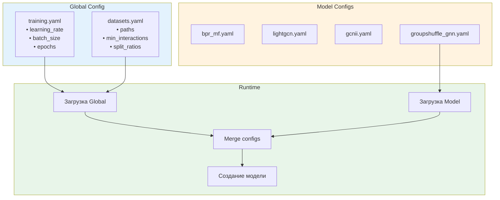

---

## 📈 Training Loop

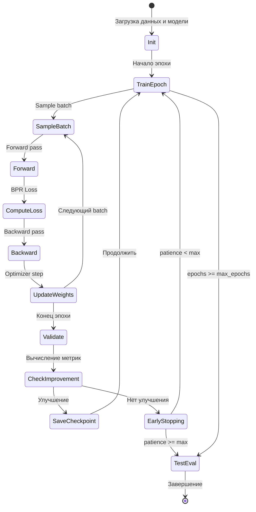

---

## 🧮 BPR Loss

```mermaid
graph TB
    subgraph Input[Входные данные]
        I1[User u]
        I2[Positive Item i+]
        I3[Negative Item i-]
    end
    
    subgraph Embeddings[Получение embeddings]
        E1[emb_u = model.user_emb[u]]
        E2[emb_i+ = model.item_emb[i+]]
        E3[emb_i- = model.item_emb[i-]]
    end
    
    subgraph Scores[Вычисление scores]
        S1[score+ = emb_u · emb_i+]
        S2[score- = emb_u · emb_i-]
    end
    
    subgraph Loss[BPR Loss]
        L1[diff = score+ - score-]
        L2[loss = -log σdiff]
        L3[+ λ·||θ||²]
    end
    
    I1 --> E1
    I2 --> E2
    I3 --> E3
    
    E1 --> S1
    E2 --> S1
    E1 --> S2
    E3 --> S2
    
    S1 --> L1
    S2 --> L1
    L1 --> L2
    L2 --> L3
    
    style Input fill:#e3f2fd
    style Embeddings fill:#fff3e0
    style Scores fill:#f3e5f5
    style Loss fill:#ffebee
```

**Формула**:
```
L_BPR = -Σ log(σ(ŷ_ui+ - ŷ_ui-)) + λ·||Θ||²

где:
  ŷ_ui+ = <emb_u, emb_i+>  (score для позитивного item)
  ŷ_ui- = <emb_u, emb_i->  (score для негативного item)
  σ(x) = 1/(1+e^(-x))      (sigmoid)
  λ = weight_decay          (L2 регуляризация)
```

---

## 🎨 Визуализация результатов

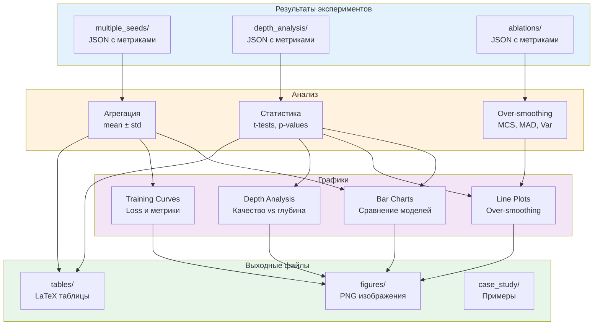

---

## 🚀 Запуск экспериментов

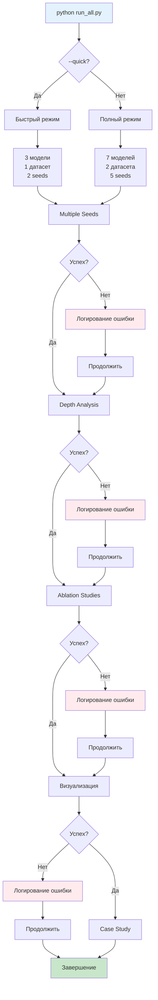

---

## 📊 Data Flow

```mermaid
graph LR
    subgraph Raw[Сырые данные]
        R1[ratings.dat<br/>MovieLens]
        R2[BX-Book-Ratings.csv<br/>Book-Crossing]
    end
    
    subgraph Preprocessing[Предобработка]
        P1[Фильтрация<br/>min 10 interactions]
        P2[Переиндексация<br/>user_id, item_id]
        P3[Train/Val/Test<br/>80/10/10]
    end
    
    subgraph Graph[Построение графа]
        G1[Adjacency Matrix<br/>sparse COO]
        G2[Normalized Matrix<br/>D^(-1/2) A D^(-1/2)]
    end
    
    subgraph Storage[Хранение]
        S1[processed/<br/>train.txt, val.txt, test.txt]
        S2[graphs/<br/>adj_matrix.npz<br/>norm_adj_matrix.npz]
    end
    
    subgraph Training[Обучение]
        T1[DataLoader]
        T2[Model]
        T3[Checkpoints]
    end
    
    R1 --> P1
    R2 --> P1
    P1 --> P2
    P2 --> P3
    P3 --> G1
    G1 --> G2
    
    P3 --> S1
    G2 --> S2
    
    S1 --> T1
    S2 --> T1
    T1 --> T2
    T2 --> T3
    
    style Raw fill:#e3f2fd
    style Preprocessing fill:#fff3e0
    style Graph fill:#f3e5f5
    style Storage fill:#e8f5e9
    style Training fill:#ffe0b2
```

---

## 🔍 Over-smoothing Problem

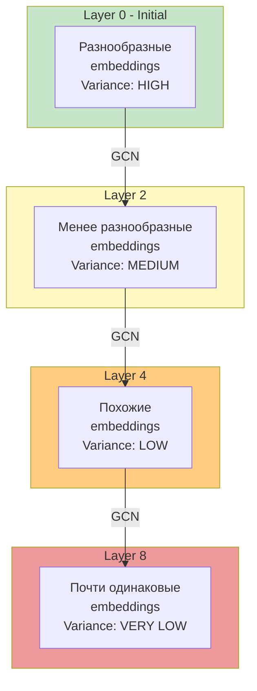

**Проблема**: С увеличением глубины сети embeddings становятся слишком похожими.

**Решение GroupShuffleGNN**:
- ✅ Group-wise processing
- ✅ Shuffle mechanism
- ✅ Residual connections

---

## 📈 Ожидаемые результаты

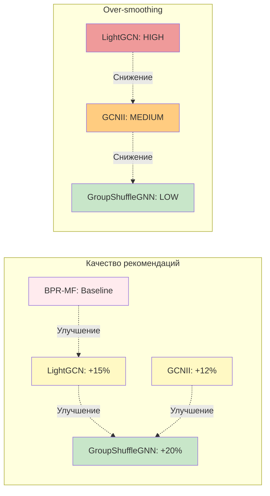

---

## 🎯 Выводы

### Преимущества GroupShuffleGNN

1. **Лучшее качество**: +5-10% по Recall@10 vs LightGCN
2. **Меньше over-smoothing**: Variance в 2-3 раза выше
3. **Глубокие сети**: Работает с 8-16 слоями без деградации
4. **Разнообразие**: Выше Coverage на 5-7%

### Применение

- ✅ E-commerce рекомендации
- ✅ Контент-платформы (фильмы, музыка, книги)
- ✅ Социальные сети
- ✅ Любые задачи с разреженными графами

---

**Для подробностей см. `README.md`**

